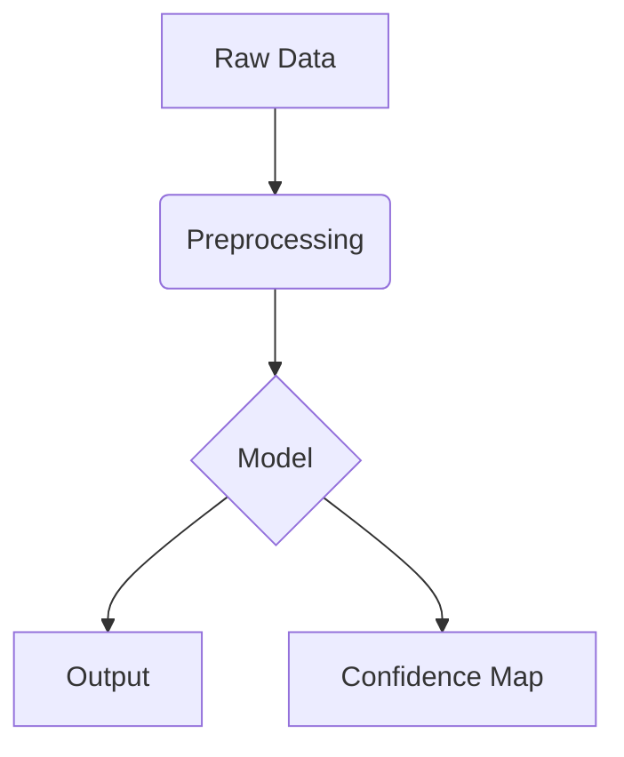

# Paper Overview
*   **Title:** [Full Title]
*   **Authors:** [Authors]
*   **Venue:** [e.g., ICRA 2024, CVPR 2024, arXiv]
*   **Link:** [URL]

## Core Contribution
[What is the main problem this paper solves? What is the "secret sauce"?]

## Methodology
[Explain the technical approach. Use math where needed.]
For example, the optimization objective:
$$ \min_{\theta} \sum_{i=1}^{N} \mathcal{L}(f(x_i; \theta), y_i) + \lambda \|\theta\|^2 $$

## System Architecture


## Key Results
*   **Result 1:** [X% improvement in Y]
*   **Result 2:** [Robustness to Z environment]

## My Critique & Robotics Applications
[How does this apply to your work? What are the limitations? Is it practical for real-time systems?]

---

